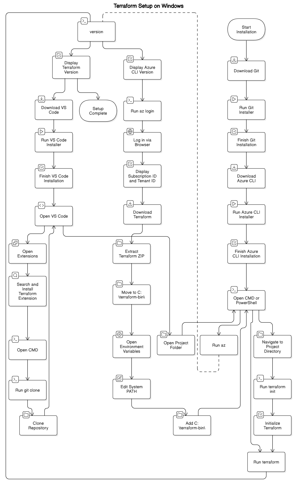

- [Guide to setting up Terraform on Windows](#guide-to-setting-up-terraform-on-windows)
  - [**Step 1: Install Git for Windows**](#step-1-install-git-for-windows)
  - [**Step 2: Install Azure CLI**](#step-2-install-azure-cli)
  - [**Step 3: Verify Azure CLI Installation**](#step-3-verify-azure-cli-installation)
  - [**Step 4: Log into Azure**](#step-4-log-into-azure)
  - [**Step 5: Install Terraform**](#step-5-install-terraform)
  - [**Step 6: Add Terraform to System PATH**](#step-6-add-terraform-to-system-path)
  - [**Step 7: Verify Terraform Installation**](#step-7-verify-terraform-installation)
  - [**Step 8: Install Visual Studio Code**](#step-8-install-visual-studio-code)
  - [**Step 9: Install Terraform Extension in VS Code**](#step-9-install-terraform-extension-in-vs-code)
  - [**Step 10: Clone or Download Terraform Course Repo**](#step-10-clone-or-download-terraform-course-repo)
  - [**Step 11: Open Terraform Project in VS Code**](#step-11-open-terraform-project-in-vs-code)
  - [**Step 12: Initialize Terraform**](#step-12-initialize-terraform)
  - [**Step 13: Verify Terraform Setup**](#step-13-verify-terraform-setup)

# Guide to setting up Terraform on Windows

Here is a step-by-step guide to setting up **Terraform** on a **Microsoft Windows** operating system:

---

## **Step 1: Install Git for Windows**

Git is required for version control and working with repositories.

1. **Download Git** from [Git for Windows](https://git-scm.com/downloads) .
2. **Run the Installer**: - Double-click the downloaded `.exe` file. - Click **Next** for all default options. - Click **Install**.
   ``Wait for the installation to complete.

- Click **Finish**.

---

## **Step 2: Install Azure CLI**

Azure CLI is needed to interact with Azure services.

1. **Download Azure CLI** from [Azure CLI Download Page](https://aka.ms/installazurecliwindows) .
2. **Run the Installer**:
   - Double-click the downloaded `.msi` file.
   - Accept the license agreement.
   - Click **Next** for all default options.
   - Click **Install** and wait for completion.
   - Click **Finish**.

---

## **Step 3: Verify Azure CLI Installation**

1. Open **Command Prompt (CMD)** or **PowerShell**.
2. Run: az --version
3. If the installation is successful, it will display the installed version.

---

## **Step 4: Log into Azure**

1. Open **Command Prompt (CMD)** or **PowerShell**.
2. Run: az login
3. A browser window will open. Log in with your Azure credentials.
4. After logging in, your **subscription ID** and **tenant ID** will be displayed.
   **To list available subscriptions**, run:

```sh
az account list --output table
```

**To set the active subscription**, run:

```sh
az account set --subscription "<your-subscription-id>"
```

---

## **Step 5: Install Terraform**

1. **Download Terraform** from the [Terraform website](https://developer.hashicorp.com/terraform/downloads) .
2. Select the Windows **AMD64** version.
3. **Extract the ZIP file**:
   - Right-click on the downloaded `.zip` file and select **Extract All**.
   - Extract it to `C:\terraform-bin\` (you can create this folder in C drive).

---

## **Step 6: Add Terraform to System PATH**

1. Open **Start Menu** → Search for **Environment Variables**.
2. Click **Edit the system environment variables**.
3. Under the **Advanced** tab, click **Environment Variables**.
4. Under **System variables**, find and select **Path**, then click **Edit**.
5. Click **New**, then add: C:\terraform-bin\
6. Click **OK** → **OK** → **OK** to close all windows.

---

## **Step 7: Verify Terraform Installation**

1. Open **Command Prompt (CMD)** or **PowerShell**.
2. Run: terraform -version
3. If Terraform is installed correctly, it will display the installed version.

---

## **Step 8: Install Visual Studio Code**

1. **Download VS Code** from [VS Code Download](https://code.visualstudio.com/Download) .
2. **Run the Installer**:
   - Double-click the downloaded `.exe` file.
   - Click **Next** for all default options.
   - Check **"Add to PATH (requires restart)"**.
   - Click **Install** and wait for completion.
   - Click **Finish**.

---

## **Step 9: Install Terraform Extension in VS Code**

1. Open **VS Code**.
2. Click on **Extensions (Ctrl+Shift+X)**.
3. Search for **Terraform**.
4. Click **Install** on the **Terraform extension** by HashiCorp.

---

## **Step 10: Clone or Download Terraform Course Repo**

If you're following a course, you might need to clone a GitHub repository.

1. Open **Command Prompt (CMD)**.
2. Run: Or download the ZIP file and extract it manually.git clone https://github.com/stacksimplify/terraform-azure-course.git

---

## **Step 11: Open Terraform Project in VS Code**

1. Open **VS Code**.
2. Click **File** → **Open Folder**.
3. Select the **Terraform project folder** you just downloaded or cloned.
4. Click **Select Folder**.

---

## **Step 12: Initialize Terraform**

1. Open **Command Prompt (CMD)** or **PowerShell**.
2. Navigate to your Terraform project directory: cd C:\terraform-azure-course
3. Run: This will initialize Terraform and download necessary providers.terraform init

---

## **Step 13: Verify Terraform Setup**

Run:

```sh
terraform -version
```

If the Terraform version appears, your setup is complete! 🎉

---


