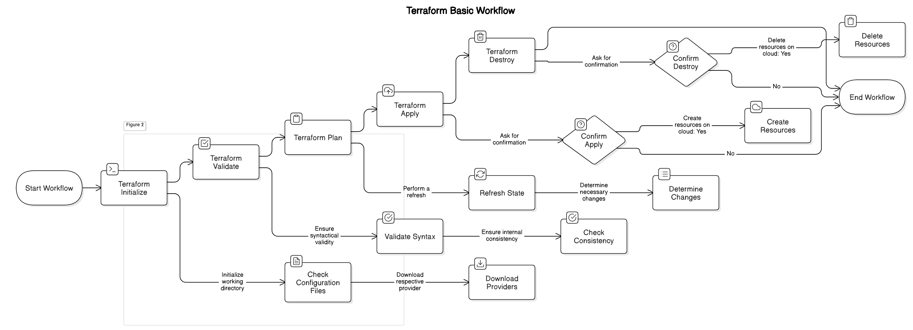

- [Terraform Basic Workflow](#terraform-basic-workflow)
  - [Overview](#overview)
  - [**Terraform Workflow Commands**](#terraform-workflow-commands)
    - [**1. Terraform Initialize (`terraform init`)**](#1-terraform-initialize-terraform-init)
    - [**2. Terraform Validate (`terraform validate`)**](#2-terraform-validate-terraform-validate)
    - [**3. Terraform Plan (`terraform plan`)**](#3-terraform-plan-terraform-plan)
    - [**4. Terraform Apply (`terraform apply`)**](#4-terraform-apply-terraform-apply)
    - [**5. Terraform Destroy (`terraform destroy`)**](#5-terraform-destroy-terraform-destroy)
  - [**Terraform Working Directory**](#terraform-working-directory)
  - [**Basic Workflow in Visual Studio Code (VS Code)**](#basic-workflow-in-visual-studio-code-vs-code)
  - [**Additional Notes**](#additional-notes)

# Terraform Basic Workflow

## Overview

Terraform follows a structured workflow consisting of several essential commands. These commands help in initializing, validating, planning, applying, and destroying infrastructure resources efficiently. Below is a step-by-step guide to understanding and using these Terraform commands.

---

## **Terraform Workflow Commands**

### **1. Terraform Initialize (`terraform init`)**

- Initializes the working directory containing Terraform configuration files.
- Downloads and installs the necessary Terraform providers.
- The first command that should be run after writing configuration files.

**Example:**

```sh
terraform init
```

---

### **2. Terraform Validate (`terraform validate`)**

- Checks the Terraform configuration files for syntax errors and logical inconsistencies.
- Ensures all required attributes are present and formatted correctly.

**Example:**

```sh
terraform validate
```

---

### **3. Terraform Plan (`terraform plan`)**

- Creates an execution plan that shows what Terraform will do when applied.
- Compares the current state with the desired configuration.
- Helps in reviewing changes before applying them.

**Example:**

```sh
terraform plan
```

---

### **4. Terraform Apply (`terraform apply`)**

- Creates or updates resources as defined in the Terraform configuration files.
- Prompts for confirmation before executing changes.
- Executes the plan to bring the infrastructure to the desired state.

**Example:**

```sh
terraform apply
```

_To automatically approve and apply changes without manual confirmation:_

```sh
terraform apply -auto-approve
```

---

### **5. Terraform Destroy (`terraform destroy`)**

- Removes all resources that were created using Terraform.
- Prompts for confirmation before execution.
- Helps in cleaning up infrastructure that is no longer needed.

**Example:**

```sh
terraform destroy
```

_To automatically approve and destroy resources without manual confirmation:_

```sh
terraform destroy -auto-approve
```

---

## **Terraform Working Directory**

- Terraform configuration files are stored in a working directory.
- Typically, Terraform configuration files have a `.tf` extension.
- Example of a working directory:
  ```
  project-directory/
  ├── main.tf  # Main Terraform configuration file
  ├── variables.tf  # Variable definitions
  ├── outputs.tf  # Output definitions
  ├── terraform.tfstate  # State file (generated after apply)
  ```

---

## **Basic Workflow in Visual Studio Code (VS Code)**

1. Open **VS Code**.
2. Navigate to your Terraform working directory.
3. Run the following commands sequentially:
   ```sh
   terraform init
   terraform validate
   terraform plan
   terraform apply
   terraform destroy
   ```
4. Verify that resources are created and managed as expected.
5. Ensure that you manage Terraform state files properly.

---

## **Additional Notes**

- Always **initialize** Terraform before running any other command.
- Use **terraform plan** before applying changes to avoid unintended modifications.
- Maintain Terraform **state files** properly to ensure consistency.
- Regularly **validate** your configuration to detect errors early.

---

